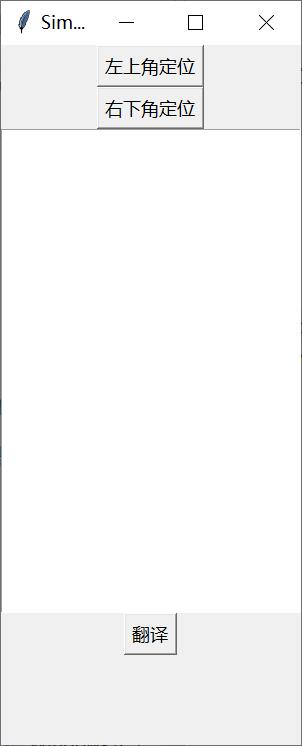
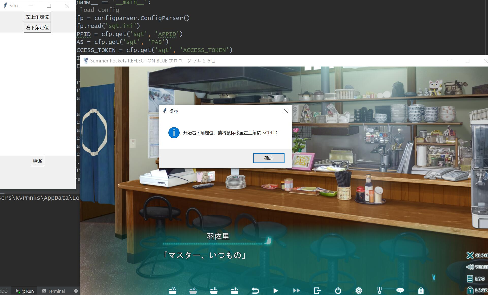

### 简单的orc+翻译功能
旨在帮助不懂日语并且打不开vnr的孩子们阅读galgame生肉(
#### 一些api
* “百度智能云”的“文字识别”中的“通用文字识别” https://cloud.baidu.com/doc/OCR/s/Mk3h7ycqx
* “百度翻译开放平台”的“通用翻译”https://api.fanyi.baidu.com/product/11

#### 使用指南
1. 填全sgt.ini中的APPID, PAS, ACCESS_TOKEN, 分别为两个api中的参数
2. 可以按按钮选择左上角与右下角来定位要翻译的区域

3. 可以按t来进行翻译，但要保持这个程序的焦点，于是只能用滑轮来翻galgame的页了，~~或许以后会改吧~~

#### 简单演示

* 定位

* 使用

